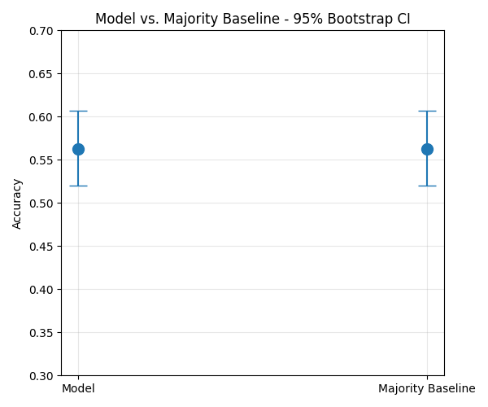

# SPY Signal Validation: Next-Day Direction Prediction

## Problem Statement

This project investigates whether historical price data can help predict SPY's next-day direction. This is genuinely uncertain because market patterns can shift over time, and a model trained on past data risks overfitting to that specific historical pattern rather than learning something that generalizes going forward. This matters because a portfolio manager could use a prediction like this to make real trading decisions, so distinguishing a genuine, reliable signal from noise has real financial consequences.

## Stakeholder & User

Decision owner: Portfolio Manager — uses the model's output and backtested performance to decide whether a systematic signal is reliable enough to inform real capital allocation.
Tool/operator: Junior Quantitative Analyst — builds, validates, and reports on the signal's performance before it reaches the PM, prioritizing honest risk-adjusted reporting over raw accuracy.

## Useful Answer & Decision

Type: Predictive (forecasting next-day price direction), evaluated through a backtested trading simulation rather than accuracy alone.
Metric/artifact: A backtest report including Sharpe ratio, maximum drawdown, and performance versus a buy-and-hold benchmark, alongside a clear conclusion on whether the signal shows genuine, risk-adjusted edge.

## Assumptions & Constraints

Stationarity: assumes patterns identified in historical SPY data will continue to hold going forward.
Liquidity: assumes SPY can be traded at the needed size without materially moving its price (reasonable given SPY's high trading volume).
Transaction costs: assumes backtested costs and slippage reasonably reflect real trading costs.
Data granularity: limited to daily OHLCV data, no intraday price information.
Time horizon: framed around next-day direction prediction specifically, not longer-term forecasting.

## Known Unknowns / Risks

Uncertain whether the model's edge, if any, reflects a genuine pattern or overfitting to the historical test period.
Market regime shifts could invalidate learned patterns without warning.
Unknown future volatility spikes or market shocks not represented in historical training data.
Mitigation: walk-forward validation (not random train/test splits) to reduce lookahead bias, and comparison against a random-signal baseline to test whether performance exceeds chance.

## Repo Structure

`data/`, `src/`, `notebooks/`, `docs/`, `model/`, `reports/`

## Data Storage

- `data/raw/` — unedited source data as pulled from Yahoo Finance
- `data/processed/` — cleaned/derived data
- File format: CSV
- Code reads/writes via `save_raw_data()` / `load_raw_data()` in `src/utils.py`, which resolve paths from the `DATA_DIR` environment variable (set in `.env`) rather than hardcoded paths.

## Data Preprocessing

Cleaning functions live in `src/cleaning.py`: datetime indexing, duplicate removal, chronological sorting, forward-fill for missing values. Applied via `preprocess_pipeline()`, output saved to `data/processed/spy_processed.csv`.

## Exploratory Data Analysis

See `notebooks/project_pipeline.ipynb` for full EDA. Summary stats and visualizations generated via `src/eda.py`.

## Feature Engineering

| Feature | Rationale |
| --- | --- |
| `ma_5`, `ma_10`, `ma_20` | Moving averages smooth noise and reveal trend direction; price relative to its MA is a standard momentum signal |
| `momentum` | Captures recent price change magnitude; short-term momentum has historically shown some persistence |
| `volatility` | Rolling std of returns gives regime context — same price move means different things in calm vs. turbulent markets |
| `rsi` | Standard technical indicator flagging potential overbought/oversold reversal points |
| `target` | Label: whether next day's close is higher than today's (binary classification target) |

**Important note on `target`:** this is the only feature that looks forward (`shift(-1)`), which is intentional since it's the label being predicted. All other features use only past/current data (`shift()` positive, `.rolling()`) to avoid lookahead bias.

## Modeling

**Approach:** Binary classification (next-day direction), using walk-forward validation across 5 time-ordered folds — never a random split, since shuffling would leak future information into training.

**Models compared:** Logistic Regression and Random Forest, both wrapped in a sklearn Pipeline (StandardScaler + model) for reproducibility.

**Key assumption:** Each fold trains only on data prior to its test period, simulating how the model would actually be used in production.

**Risk-aware interpretation:** The confusion matrix for the final fold shows the logistic regression model predicted class 1 ("up") for all 481 test observations, never once predicting class 0 ("down"). This confirms the model collapsed to a majority-class strategy rather than learning a genuine signal from the engineered features. Reported accuracy (~56% in this fold) is mathematically equivalent to the base rate of "up" days in the test period, not evidence of predictive skill. A model with 99% accuracy that never predicts "down" would look impressive while being equally useless — which is exactly why accuracy alone is an insufficient metric here.

## Evaluation & Risk Communication

**Model performance:** Logistic regression achieved 56.26% accuracy on the final walk-forward fold, with a 95% bootstrap CI of [0.5197, 0.6071]. The majority-class baseline achieved an identical 56.26% accuracy with the exact same confidence interval — because the model's predictions were, in practice, identical to the baseline's (it predicted the majority class for every single test observation). This isn't just overlap; it's mathematical identity, confirming the model added no distinguishable value beyond the naive baseline.

**Key assumptions:** (1) Walk-forward validation assumes each fold's train/test boundary reasonably approximates real-world deployment. (2) Features assume technical price patterns carry predictive information, an assumption not supported by this result.

**Scenario sensitivity:** Comparing the full feature set against a reduced momentum-only set showed 56.3% accuracy — nearly identical to the full feature set's 56.26%. This consistency across feature choices further supports that no individual feature set is extracting a genuine signal.

**Risks and limitations:** The identical confidence intervals mean the apparent "edge" in the point-estimate accuracy is not statistically reliable and should not inform real capital allocation.

**Production monitoring, if this were live:** Would require tracking live accuracy against the same majority-baseline CI on a rolling basis, with an alert if live performance permanently diverges from baseline in either direction.

**Stakeholder summary (plain language):** This model does not currently outperform simply betting that SPY goes up more often than it goes down. This is a common, honest result for daily-direction prediction on a liquid, heavily traded asset — robust validation successfully caught an illusory pattern before it could be mistaken for a real trading edge.

## Backtest with Transaction Costs

Translating predictions into an actual long/flat trading strategy, with a 5 bps transaction cost applied on every position change, the model strategy's performance was not meaningfully different from the majority-class baseline strategy under the same cost assumptions — confirming the earlier accuracy-based finding at the P&L level.

## Setup Instructions (fresh clone)

1. Clone the repo
2. `conda create --name spy-signal-env python=3.10 && conda activate spy-signal-env`
3. `pip install -r requirements.txt`
4. `cp .env.example .env` and fill in values
5. Run `notebooks/project_pipeline.ipynb` top to bottom
6. In a separate terminal: `python app.py` to launch the API

## Example API Request

POST `http://127.0.0.1:5000/predict`
Body: `{"ma_5": ..., "ma_10": ..., "ma_20": ..., "momentum": ..., "volatility": ..., "rsi": ...}`
Response: `{"prediction": 1, "meaning": "1=up, 0=down"}`

## Stakeholder Handoff Summary

**Overview:** End-to-end pipeline testing whether technical price features predict SPY's next-day direction, from raw data through a deployable API.

**Key findings:** The model does not outperform a naive majority-class baseline — confirmed via walk-forward validation and bootstrap confidence intervals.

**Recommendation:** Do not use this signal for real capital allocation as-is. Valuable as a rigorously validated negative result and a reusable pipeline for testing future signal candidates.

**Assumptions & limitations:** Daily OHLCV only, no intraday or macro data; next-day horizon only; technical features only, no fundamental data.

**Risks:** Any future signal must pass the same baseline-comparison bar before being trusted; higher apparent accuracy should trigger leakage suspicion, not confidence.

**Using the deliverables:** Run the notebook for full analysis and charts; use the Flask API (`/predict`) for programmatic access to the trained model.

**Suggested next steps:** Test longer horizons, incorporate non-price features, apply this same validation framework to new candidate signals.